# Solución de Daniel Muñoz a la prueba técnica de NodeJS para Alub.io

Todos los apartados están resueltos y tienen una release particular en este repositorio a la que iré haciendo referencia conforme tenga lugar. Cabe decir que todas las releases parten de la rama 'master', algo que no sigue los patrones 'gitFlow', pero lo hice simplemente por ahorrar el tiempo de crear la rama 'develop', las diversas ramas 'feature' y las correspondientes ramas 'release'. Menciono esto para explicar que realmente no habría problemas en crear y gestionar repositorios que sigan patrones más ortodoxos.

Finalmente, debe resultar un backend con la siguiente estructura de carpetas:  

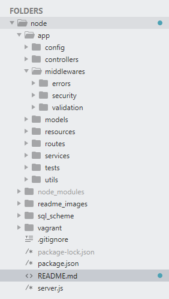

Como voy a hablar de numerosas carpetas y ficheros, consideraré como directorio raíz la raíz de este repositorio, de modo que la ruta ```/``` se traduciría en vuestros equipos en: ```C://ruta/donde/clone/mi/repo/```. Y sin ánimo de alargarme más, comenzamos.

## Prerequisitos

Un punto relevante antes de comenzar a ejecutar el proyecto sería hablar de las versiones que he utilizado para desarrollarlo. En este caso fueron:

* NodeJS - versión 12.18.4
* MySQL - versión 8.0.12
* MySQL Workbench - versión 8.0
* Postman - versión 7.32.0

Todo está desarrollado en mi equipo local, pero si necesitarais arrancar una máquina virtual estandarizada, he dejado un archivo Vagrantfile dentro de la ruta ```/vagrant```, el cual arrancaría un Ubuntu 18, e instalaría NodeJS en su versión 12, MySQL en su última versión, Docker y Docker-compose (para probar un posible despliegue en contenedores de nuestra solución), además de git y algunas utilidades más. Tiene hecho un mapeo de puertos, 3000 y 3306, para acceder desde nuestro localhost a los servicios del backend y la base de datos, lo que nos permitirá usar Postman y el MySQL Workbench desde nuestro local. En particular, soy muy aficionado en trabajar en máquinas virtuales como la que dejo aquí, que minimicen el riesgo de fallos por versión; pero en este caso, el desarrollo no se efectuó en dicha máquina virtual, sólo la creo por si puede servir de ayuda.

Una vez instalados los prerequisitos, damos comienzo a la solución de la prueba.

## Misión 1 - Crear una API de Empresas Gatunas.

Para realizar las diversas misiones crearemos varios endpoints, tales como /companies, /favorites o /owners. A la hora de ser llamados, se hará bajo la ruta: ```http://localhost:3000/api/companies```, con ```/api``` incluido en la URL, para el caso del endpoint /companies, por ejemplo. Y esto lo hago para diferenciar las rutas del back con respecto a las del front, cosa indispensable si el PMV se quisiera desplegar en el mismo equipo, aunque sobre todo lo hago por ser una buena práctica.

### A. Creación de Empresas - RELEASE: Misión 1 - A.

He dejado el script de sql bajo la ruta ```/sql_scheme/database_scheme.sql```. En mi caso, ejecuto dicho script desde el MySQL Workbench, usando ```File -> Run SQL Script...```, lo que es muy cómodo para crear la base de datos y gestionarla. En cualquier caso, debería ser posible hacerlo por línea de comandos también, aunque no lo he probado. Es necesario correr dicho script antes de arrancar nuestro backend en la release mencionada, de lo contrario el paquete Sequelize, que mencionaré posteriormente, no podrá conectar con pixomaticdma y nada funcionaría.

He intentado colocar un tipo de datos adecuado para cada dato, evitando usar 'varchar(255)' demasiado. No soy ningún experto en SQL, pero creo que el resultado es razonable y no hay problemas en la ejecución. Como constraints, he puesto que el campo cif, name y token (para un ejercicio posterior), deberán ser únicos, pues me pareció lo más razonable, y como primary_key he puesto el id de la tabla.

Toda la gestión de la base de datos la realizo con el paquete Sequelize. Lo hago para facilitarme la vida al manejar los modelos, pero sobre todo, porque Sequelize ya lleva incorporadas ciertas funciones estándar para interactuar con la base de datos que corresponderían a la creación de un patrón repositorio en mi código, lo cual ahorra muchísimo trabajo y me permite interactuar de manera muy cómoda. No he utilizado el cli de Sequelize para crear los modelos, los cuales están hechos a mano, y se encuentran bajo la ruta ```/app/models```. De otro modo, Sequelize me habría creado el directorio 'Migrations', pero el cli me parece demasiado engorroso para proyectos pequeños, y prefiero crear yo mismo todo lo necesario.

* IMPORTANTE: para que Sequelize se conecte correctamente a la base de datos será necesario escribir nuestra contraseña de administrador de SQL en el archivo ```/app/config/constants.js```, que es un objeto de constantes. La contraseña la escribiremos en 'db_config.PASSWORD', que en mi caso es: 'danira10'.

Bajo la ruta ```/app/config/sql_dump.js``` se encuentra un script que utilizará Sequelize al realizar la conexión a la base de datos en el fichero ```/server.js```. Este script introduce 220 empresas en pixomaticdma, ya que en una parte posterior del enunciado así se requiere para poder comprobar un cierto reto relacionado con la paginación. La empresa que crearemos nosotros será la 221 en base de datos.

Existen en este punto también los ficheros ```/app/config/constants.js```, ```/app/db.config.js``` y ```/app/utils/utils.js``` , además de los comunes (server, models, routes, controllers y middlewares). Los ficheros de constantes y de funciones útiles están completos, como lo estarían al final del proyecto habiendo realizado todas las misiones. Los dejo así por simplificar, porque estoy escribiendo esto con el proyecto ya acabado. 

Quiero destacar que he creado bajo la ruta ```/app/middlewares/errors/server.errors.middlewares.js``` el middleware para gestión de errores que usaré en el 'server.js'. Es algo sencillo pero potente, que combinado con las funciones 'createError' y 'createResponse' que podemos encontrar en ```/app/utils/utils.js```, permiten capturar y mostrar correctamente formateados todos los errores de una manera sencilla.

También decir que en dicho fichero 'utils.js' incluyo algunas funciones de validación de variables al estilo 'lodash'. Lo hago porque no eran muy numerosas y así evito instalar lodash, con los correspondientes problemas que está dando a nivel de seguridad.

Por último, veréis que mi estilo es muy try/catch y async/await, dejando un poco más de lado los callbacks, promesas y la librería rxjs. Quiero decir en este punto que es la forma en que más limpio y claro veo el código, pero que no hay ningún problema en seguir algún otro patrón de programación.

Ya estamos preparados para ejecutar ```npm install```, bajo la ruta ```/```, seguido de ```node server.js```. No voy a escribir aquí la batería de pruebas pasada a cada endpoint para no alargarme demasiado, pero se puede comprobar con Postman el funcionamiento del código. He creado en este punto también un middleware de validación para comprobar los parámetros pasados a todas las peticiones y enviar un error en caso de que no cumplan las espectativas de la documentación, se puede encontrar en ```/app/middlewares/validation/company.validation.middlewares.js```. Así, si alguno de los parámetros de la petición no cubre las especificaciones obtendremos un error indicándonoslo, de la misma manera que si intentamos introducir una empresa con el mismo CIF o name que otra ya existente. Podemos ver un ejemplo de petición exitosa aquí, creando la empresa con id 221:

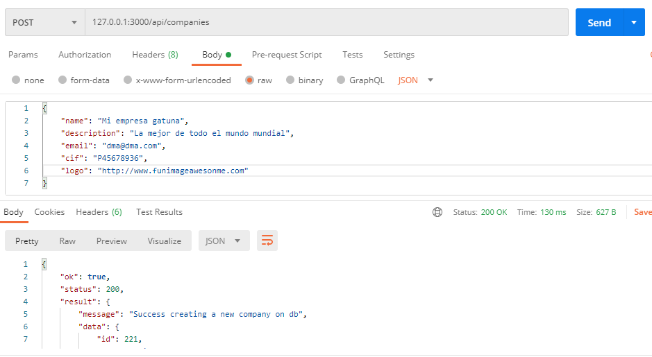  

* IMPORTANTE: Si se van a ejecutar las distintas versiones del código release a release, será necesario hacer ```npm install``` cada vez que descarguemos una release nueva. Esto es obvio pero no está de más recordarlo :). También se puede descargar la última release con todas las funcionalidades finales ya implementadas.

### B. Editar Empresa - RELEASE: Misión 1 - B.

Simplemente añadimos la nueva función al controlador, la nueva ruta y el nuevo apartado en el middleware de validación, todo bajo los paths: ```/app/controllers/company.controller.js```, ```/app/routes/company.routes.js``` y ```/app/middlewares/validation/company.validation.middlewares.js```.

Ejemplo de nuestra empresa actualizada correctamente:  

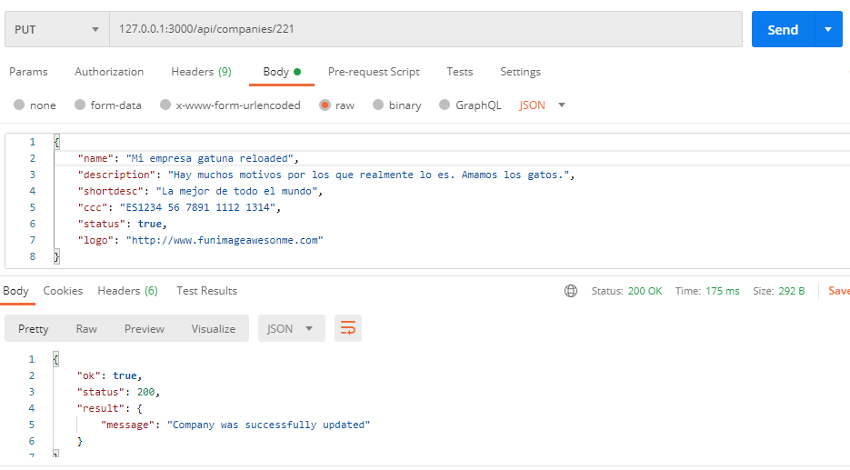

### C. Listar Empresas - RELEASE: Misión 1 - C.

De la misma manera que en el paso anterior, actualizamos controller, routes y middleware de validación para ejecutar esta función. 

De todos los campos guardados en base de datos, nuestro endpoint devuelve todos los campos menos cif, ccc y token (que aparecerá posteriormente en la documentación, aunque me haya adelantado incluyéndolo). Realmente podría devolver todo y que el front fuera el encargado de filtrar los campos de la respuesta, pero supongo que no está de más quitarle trabajo.

Resultado:  

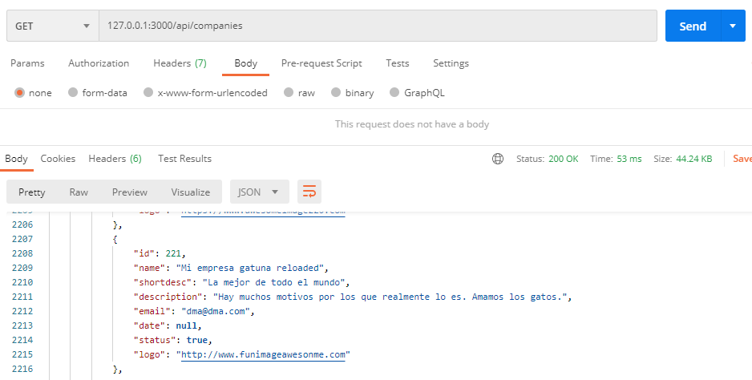  

### D. Buscar Empresas - RELEASE: Misión 1 - D.

En este apartado modificamos los mismos ficheros que en los tres apartados anteriores. Con ello queda resuelta la misión 1.

Cabe mencionar que, a pesar de que la documentación indica que el front no activaría el botón de buscar si el patrón introducido es de menos de tres letras, creo que es una muy buena práctica volver a hacer la validación en el back, ya que el usuario podría desactivar el javascript de su navegador y esas validaciones realizadas por el front no tendrían lugar en ese hipotético caso, dejando a nuestro servidor muy vulnerable a posibles ataques. Es por ello que nuestro server incluye la validación del patrón en el middleware de validación.

Resultado:  

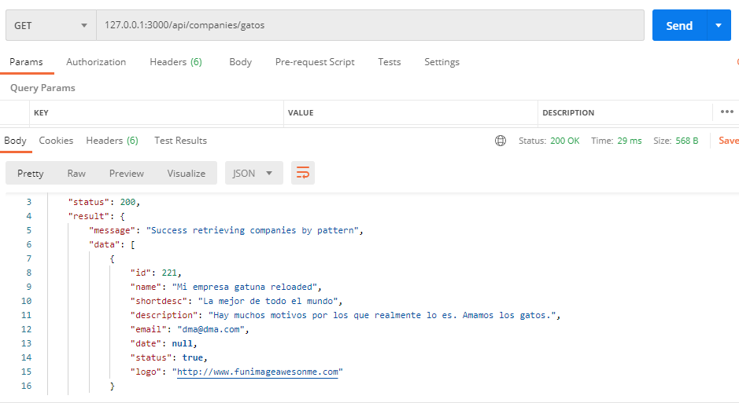 

### Reto A. API paginada - RELEASE: Misión 1 - Reto A.

La paginación la conseguimos recibiendo el parámetro page, si procede, y ajustando los parámetros de offset y limit, como indica la documentación. Todo ello en el fichero ```/app/controllers/company.controller.js```.

Resultado:  

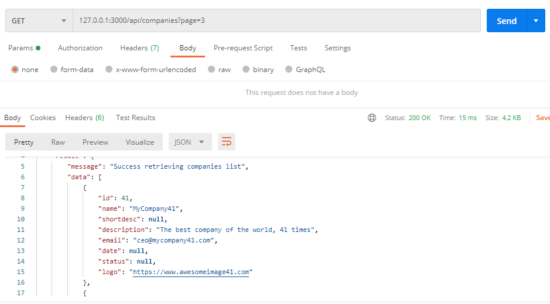  

### Reto B. Securizando la API Editar - RELEASE: Misión 1 - Reto B.

Aquí incluímos el middleware 'verifyCompanyToken' situado bajo la ruta ```/app/middlewares/security/company.security.middlewares.js```, el cual se encarga de recibir el nuevo auth token, y comprobar que, efectivamente, corresponde con el de alguna de las empresas registradas en base de datos, todo ello para permitir una nueva actualización.

Cabe mencionar que la inclusión del token en la tabla SQL y en la creación de la empresa lleva presente desde el comienzo de esta app, por ser demasiado engorroso para mí el borrar ciertas líneas que ya estaban programadas en la app final, para ir sacando el código release por release.

Resultado cuando no introducimos un token válido:  

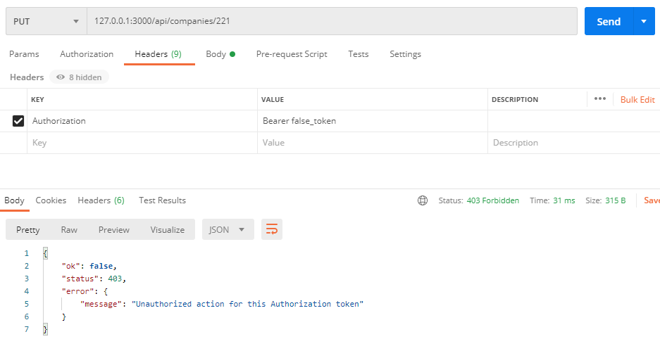 

### Reto C. Seguridad.

Creo que el método anterior puede no ser del todo seguro por varias razones:

* Porque el token se guarda sin encriptar en base de datos. Si alguien consigue entrar en ella, podría leerlo sin problemas.
* Porque el token identifica a una empresa y no al usuario que quiere editar dicha empresa, lo que no sería conveniente en el mundo real, debiendo verificar previamente que el usuario que busca editar una empresa tiene permiso para hacerlo.
* Porque desde el frontal es necesario conocer el token previamente para atacar al método 'update', y puesto que el token ha sido generado en el back, es necesario que el front pida al back dicho token. Esto genera dos problemas que aún no han sido contemplados: el primero es que el token debería viajar encriptado para poder intercambiarlo de forma segura (con un algoritmo de encriptación de doble vía, quizá), y el segundo es que no cualquier equipo debería poder solicitar dicho token al back, tan sólo el frontend de nuestra aplicación (lo que podría solucionarse configurando el cors, por ejemplo).

## Misión 2 - Integrando con la API de Usuarios.

### A. API Pasarela de Usuarios - RELEASE: Misión 2 - A.

Para realizar esta parte de la misión incluimos un nuevo endpoint: /owners. Se añade el fichero de rutas, controlador, middleware de validación (controlando que el parámetro page sea un número válido), bajo las rutas ya conocidas, se modifica el server.js para incluir dichas rutas y se crea el fichero ```/app/services/owner.services.js```, el cuál servirá para aislar las peticiones a la API externa de /users, del controlador de owners de nuestro back. Se ajusta la paginación de nuestro método get para que coincida con la de la API /users. 

Resultado:  

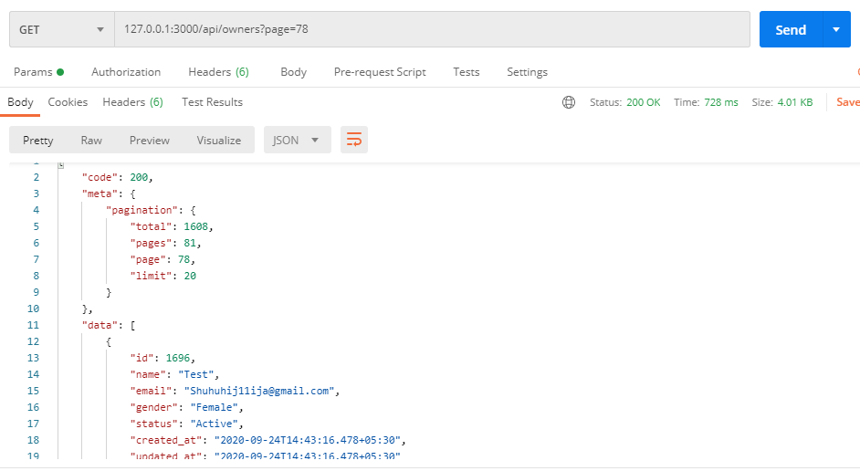 

### B. Crear una API de Favoritos - RELEASE: Misión 2 - B.

En este punto he actualizado el script de SQL para incluir la nueva tabla de Favoritos a la base de datos. No me ha dado ningún problema al recargar, sigue con las mismas tablas de Companies presentes y, al actualizar mi código con el nuevo modelo, el server se conecta perfectamente sin mayor problema. No obstante, si el resultado no es igual cuando lo probéis desde Alub.io, podemos ver qué es lo que ocurre.

El método seguido para incluir un nuevo endpoint es el mismo que en el paso anterior, con la salvedad de que es necesario incluir el nuevo model Favorite en la carpeta ```/app/models/favorite.model.js``` y actualizar el fichero 'index.js' de esa misma carpeta para que Sequelize reconozca el nuevo modelo sin problemas.

De nuevo, el middleware de validación se asegura del correcto formato de los parámetros y el controlador comprueba que la relación de favorito entre el owner y la company no exista ya en base de datos. También comprueba que el owner efectivamente existe en la base de datos externa, mediante un servicio que realiza una petición a la api /users, y finalmente, comprueba que existe una empresa con el id introducido por el usuario en nuestra base de datos propia. Con todo estos esto pasos, podemos crear una nueva tabla de favoritos en bd:  

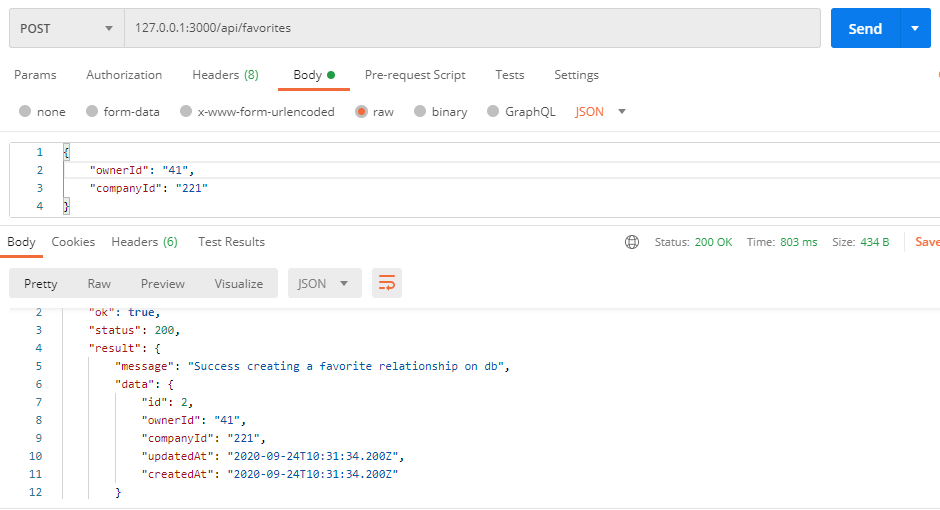

* IMPORTANTE: En este punto me he dado cuenta de que el controlador de Favorites incluye una llamada a 'manageBadRequests', después de comprobar que la validación de los parámetros recibidos por el controlador es correcta. Esta línea de código forma parte de la Misión 3 - A, y si realizamos una petición mal formada, la consola sacará unos logs indicando que no puede encontrar cierto archivo. No afecta al funcionamiento del API, pero no debería estar y ya llevo demasiado avanzado como para deshacer el cambio. Pido disculpas.  

### C. Extrayendo la info del Dueño - RELEASE: Misión 2 - C y Reto B.

* IMPORTANTE: por simplificar, esta parte de la misión incluye también el Reto B, el cual pide que, además de retornar la información del owner indicado y sus posts escritos, también incluya los comentarios asociados a cada post en un formato correcto. Lo hago así porque de lo contrario, tendría que cambiar bastante más código en los servicios y el controlado, pudiendo generar errores a posteriori.

Para esta misión se crea una nueva ruta 'get' en el controlador, en las rutas, en los servicios y en el middleware de validación de Owners, llamada 'findOwnerAndPosts', la cual recibe el id como parámetro del owner a encontrar. Esta nueva función se apoya en el fichero de servicios para hacer varias llamadas a la API /users, recabando la información del usuario, los posts escritos por él y los comentarios recibidos por cada post.

La tarea de la función es obtener toda esa información y formatearla en la forma que las instrucciones del proyecto indican, con el siguiente resultado para segundo owner (la api no tenía un owner con id 1 en ese momento):  

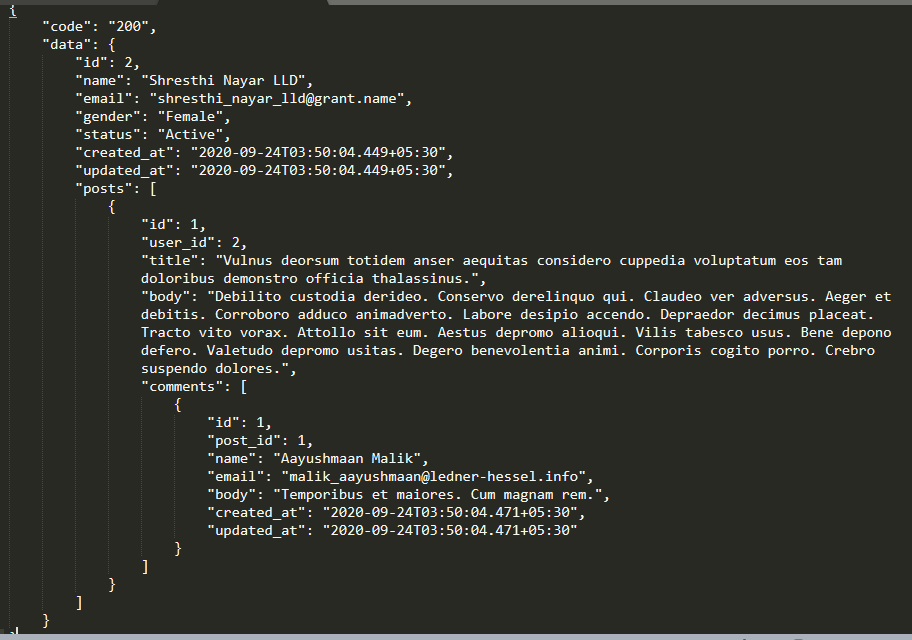 

### RETO A. Endpoint “owners” con paginado múltiple - RELEASE: Misión 2 - Reto A.

En este punto sólo he tenido que tocar levemente el método 'findAll' del controlador de owners. El problema es que las peticiones a la API /users sólo se pueden hacer con una paginación de 20 usuarios, pero nosotros queremos jugar con los parámetros page y limit para customizar la paginación del endpoint /owners. Por tanto, hay que hacer peticiones recurrentes, de veinte en veinte usuarios, con un cierto offset definido por nosotros y hasta llegar a un cierto limit. En los metadatos de la respuesta también se calcula las páginas restantes de la petición de forma dinámica, ya que las páginas de nuestro método serán más grandes que la del endpoint original. La dificultad está en encontrar el mapeo de offset/limit introducido, con el offset/limit que usará nuestro bucle de peticiones recursivas. Finalmente, el resultado fue satisfactorio:  

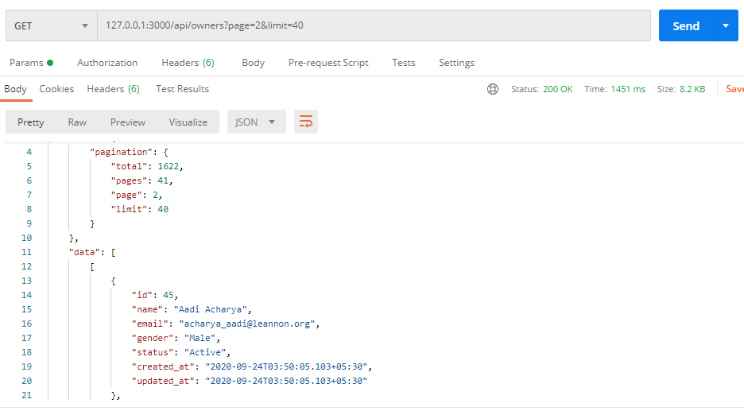
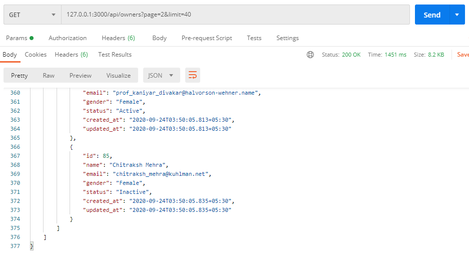

Si la respuesta no empieza y termina exactamente en los usuarios que se esperan (41 - 80), es porque la API /users no lleva un orden exacto entre los usuarios que muestra y sus respectivos ids en base de datos, pudiendo "saltarse" varios usuarios en una página.

## Mision 3. Securidad y rendimiento.

### A. Logs de Seguridad - RELEASE: Misión 3 - A.

En esta parte de la misión tres sale a relucir una función contenido en el fichero ```/app/utils/utils.js```, llamada 'manageBadRequests'. La función lee un fichero llamado 'blacklist.json' dentro del directorio ```/app/resources```, que contendrá una lista completa de las peticiones mal formadas, y por tanto, potencialmente peligrosas que lleguen a nuestro servidor, con todos los datos relevantes para seguir la traza de ataques; y además, una lista negra de las ip que han intentado atacar nuestro servidor, entendiendo como ataque toda aquella request que no cumpla con la validación controlada por los middlewares destinados a tal propósito. Basta con repasar los middlewares de validación de los tres controladores para comprobar qué peticiones serán excluídas, y basta con llamar a la función 'manageBadRequests' dentro de cada función de los controladores (a excepción del métod 'update' del controlador Company, cuya gestión de las bad requests la hace el middleware de validación del token), en caso de que la validación de los parámetros sea incorrecta, para incluir dicha request en nuestra traza de ataques y la ip correspondiente dentro de la lista negra.

Incluyo también dentro de la carpeta resources, un fichero llamado 'routes_enabled.json', que contendrá las distintas rutas abiertas de nuestra api, así como los métodos permitidos para cada endpoint, todo ello de cara a la resolución del reto B de la misión 3.

Ejemplo de cómo quedaría el fichero blacklist si alguien intenta crear una empresa sin incluir el CIF, por ejemplo:  

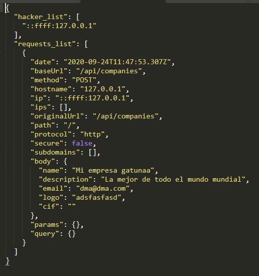

* IMPORTANTE: En este punto me he dado cuenta de que el controlador de Favorites (Misión 2 - B), tenía ya la llamada a 'manageBadRequests' incluída en el código cuando no debería. Esto no va a provocar ningún error en el funcionamiento, simplemente puede aparecer un error en los logs del server indicando que no se puede encontrar el archivo blacklist.json, debido a que la ruta del archivo aún no existía. Pido disculpas por no haber quitado esa pequeña línea en su momento.

### B. Rendimiento.

* Aquí se me ocurre que podríamos crear una caché, bien mediante ficheros, bien mediante la base de datos, donde almacenemos los datos del usuario cada vez que este cree un nuevo perfil o lo actualice (suponiendo que para crearlo o actualizarlo debe pasar por nuestro endpoint /owners, que sirve como puente al endpoint /users). De esta manera, registramos en nuestra caché sus datos más relevantes para los usuarios y la última vez que los actualizó, y sólo lo modificaremos en el caso de que los actualice de nuevo, cosa que rara vez ocurre, como indica la documentación. Ya podemos entonces enviar la información a los distintos usuarios que la requieran sin la necesidad de realizar tantas costosas llamadas a una api externa.

### Reto A. Listado de Empresas limitado - RELEASE: Misión 3 - Reto A.

Para realizar este reto creamos un nuevo middleware de seguridad en ```/app/middlewares/security/company.security.middlewares.js``` llamado 'verifyListingLimitToken' que se encargará de aplicar la lógica impuesta por el documento del proyecto. En este punto, es el nuevo middleware de seguridad el que se encargará de la validación de los parámetros de la petición, así como de manejar las bad requests que lleguen, incluyéndolas en la blacklist. Quitamos por tanto, ese trozo de código de la función 'findAll' del controlador.

Resultado cuando no enviamos token en la búsqueda de la página 11:  

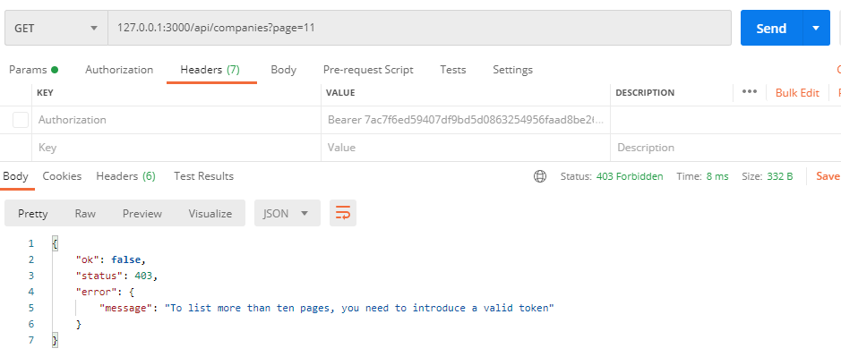

### Reto B. Detectando y evitando un Hacker - RELEASE: Misión 3 - Reto B.

En este último reto he implementado un nuevo middleware de seguridad situado en el fichero ```/app/middlewares/security/server.security.middlewares.js``` llamado 'serverProtect'. Lo único que tenemos que hacer es importarlo en nuestro 'server.js', antes de que sea llamada ninguna ruta. La lógica del código de este middleware indica que, para todas las peticiones recibidas, mira en el fichero ```/app/resources/routes_enabled.json``` si la ruta a la que el host quiere acceder es válida (definida por nosotros), y sus métodos también. En caso de no ser así, el middleware crea una nueva entrada en la lista de bad requests situada en el fichero blacklist, anotando la ip del host "atacante" como potencialmente peligrosa. Y aunque la ruta a la que el host quiere acceder y su método sean los correctos, el middleware también comprobará si ese host ya era un potencial hacker checkeando su ip en la blacklist. Si estas medidas de seguridad no devuelven ningún error, la petición continuará su curso completamente.

Aunque como reforzamiento de las medidas de seguridad, yo incluiría cors para no permitir que cualquier host ataque nuestro backend con peticiones mal formadas :)

Muestro a continuación el resultado de intentar acceder al endpoint /api/company (no válido) bajo el método PATCH:  

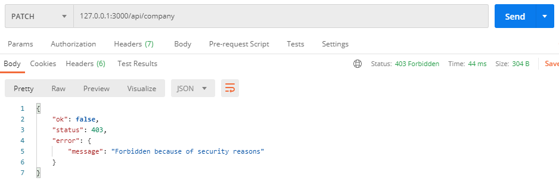

Que quedará registrado en el blacklist de nuevo, prohibiendo ataques futuros:  

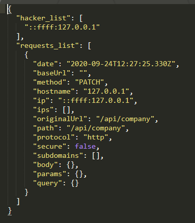  

## Últimas consideraciones

Llegando al final de este proyecto que, francamente, me ha divertido mucho, sólo quiero añadir que he intentado documentar todo de forma bastante rigurosa, tanto por los comentarios a pie de código, como por los comentarios cabecera, así como los comentarios de documentación automática presentes encima de cada función de los controladores. Estos últimos podrían servir a algún paquete como 'apiDoc' para generar documentación automática, ya que he intentado ser riguroso en la sintaxis.

Además, incluyo también una carpeta llamada 'tests', con un archivo ```/app/tests/tests.js```. Sé que en proyectos reales se suele utilizar mocha y chai, pero yo siempre creo mis propias baterías de tests gráficos (cuyo resultado se imprime por consola), con el objetivo de ir haciendo ```node /app/tests/tests.js``` cada vez que introduzco un cambio importante en el código, para comprobar que nada se ha roto. En este caso, los tests comprueban todas las funciones pero sólo en un caso de éxito (con requests bien formadas), todo esto podría ampliarse de mil formas como siempre suelo hacer, pero creo que como ejemplo es suficiente.

## Despedida

Sólo me gustaría añadir que ha sido una muy buena experiencia la realización de esta prueba para mí. Siento que he mejorado enormemente mis capacidades y realmente me gustaría continuar haciéndolo trabajando para vosotros. 

Pero, si eso nunca llega a pasar, me quedo con las horas nocturnas de código escuchando lofi hip hop, investigando, pensando mejoras y tirándome de los pelos cuando aparecían esos molestos error logs. Sinceramente, creo que tengo que hacerlo más :)

Me gustaría concluir deseándole a Alub.io toda la suerte del mundo en general, y a su gente en particular.

Sin más, un abrazo.